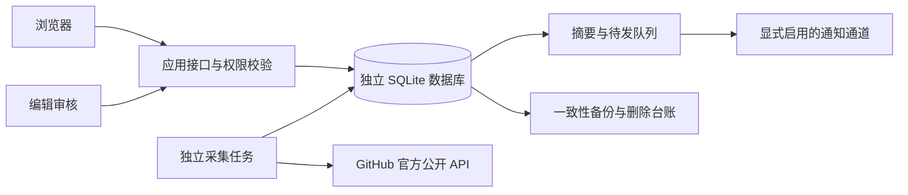

# 产品全面检查 · 2026-09-22

## 结论与范围

当前产品适合本机试点和真实数据预览。发现、资料、私有研究、审核、采集和恢复已经有可执行实现；正式账户、持续数据积累、真实内容审核、邮件与公开部署仍需完成实际配置和验收。

本轮检查以代码、可复现测试、真实预览和桌面/手机操作为依据，覆盖用户、产品、UI、权限、数据可靠性、架构、运维和源码交付。它是一次工程检查，不是外部用户研究或生产容量认证。

目前的真实样本是 8 个浏览器自动化仓库、8 份首次快照、240 条待审核版本记录和 248 条证据。没有持续采集或历史增长基线。预览访问含开发及自动化检查流量，不能用于经营结论。

## 用户最容易误解的三件事

**有 Star 总数不等于有增长值。** 计算 24 小时增长，需要最新数值与约 24 小时前的数值；7 天同理。第一次采集没有早期记录，页面应解释“待对比：缺少早期记录”。未开启后续采集时，等待一天不会自动产生数据。

**仓库不等于独立产品，抓到版本也不等于已经发布研究结论。** 当前 8 个仓库采集成功；240 条版本记录仍待核查，所以公开事件数可以为 0。页面需要同时说明已采成果与审核状态，避免“没有更新”的错误印象。

**可公开浏览不等于账户已经开放。** 当前真实预览未配置 GitHub OAuth。页面应提供明确的浏览说明，保存私有研究需在真实身份配置后使用。演示环境可验证保存流程，但不能替代真实账户验收。

## 本轮修复清单

| 方面 | 已复现的问题 | 修复方式与验证位置 |
|---|---|---|
| 数据理解 | “历史不足”没有解释缺少什么 | 统一总量、24h/7d 早期记录、再采集和调度说明；`tests/presentation.test.mjs` |
| 发现排序 | 无增长值仍暗示增长排名 | 展示服务端实际排序，移除装饰性名次；UI 及展示逻辑检查 |
| 产品空态 | 0 产品、0 公开事件掩盖已采仓库和待审版本 | 公开有限的库存计数，解释仓库/产品与采集/发布区别；不公开未审核正文 |
| 登录体验 | 未配置 OAuth 仍提供会进入错误页的链接 | 会话返回安全的能力标志；未开放时保留公开浏览路径 |
| 选型比较 | 不同版本或套餐存在多条能力判断时只取第一条 | 提示先核对版本与适用范围，保留多条判断和对应证据 |
| 键盘与异常导航 | 焦点可能离开弹层，异常编码链接可能白屏 | 模态和手机导航焦点约束、Escape、恢复焦点、安全路由解码 |
| 来源撤销 | 混合多条证据时，撤销一条仍可能公开完整衍生内容 | 引用集全部满足展示条件才可公开；阻断隐藏原文的搜索探测 |
| 角色权限 | 已登录管理员未及时受名单撤销影响；编辑可读部分经营资料 | 每次请求核对管理员配置；编辑视图过滤财务、私人投递和对应审计内容 |
| 采集恢复 | 最后一次尝试崩溃后可能长期显示执行中 | 处理过期租约与耗尽尝试；针对性任务回归测试 |
| 预算 | 重试次数重置后可能复用已记账标识 | 按一次实际任务领取记录预算，避免漏计或同一执行重复预留 |
| 删除传播 | 重新采集可能把已删除原文写回 HTTP 缓存 | 缓存写入同样核查删除要求；保留合法、未撤销的数据 |
| 报告准确性 | 历史失败可能盖过后来的成功；缓存条数被误当请求次数 | 复用最新仓库任务汇总；缓存地址数与请求预算分别标注 |
| 备份恢复 | 外部删除台账缺少环境核对；新备份权限过宽 | 校验台账模式并收紧新备份文件权限 |
| 源码交付 | 尚无仓库与持续检查 | 创建 public GitHub 仓库、`main`/`develop`，加入公开内容检查及云端构建/测试 |

具体证据、测试和剩余边界见 [用户体验检查](UX_REVIEW_2026-09-22.md)、[后端检查](BACKEND_REVIEW_2026-09-22.md)、[架构检查](ARCHITECTURE_REVIEW_2026-09-22.md)。

## 架构判断

模块化单体、独立 Worker 和单机 SQLite 适合当前窄范围试点：网页读取已有结果，外部网络请求不占用用户页面请求。真实与演示分库，采集、发布、通知具有不同的入口和条件。

主要架构限制是单机写入模型、部分列表尚无分页、接口与页面代码仍较集中，以及没有完整的任务心跳和外部告警体系。现有租约只能说明某轮任务被领取，不能证明持续调度长期健康。扩到多写入节点前，需要 PostgreSQL、明确的队列和并发恢复验证；不能靠增加容器副本放大当前 SQLite 部署。

## 下一步优先顺序

| 优先级 | 交付结果 | 验收方式 |
|---|---|---|
| 试点前 | 配置真实登录、管理员、部署域名与来源使用范围 | 两个真实账户完整往返，确认私有数据隔离和权限撤销 |
| 试点前 | 在可常驻环境启用后续采集与监控 | 跨天记录连续成功/失败，取得真实 24h 与 7d 对照；故障保持历史 |
| 核心价值 | 审核少量与具体任务有关的真实产品、版本和能力证据 | 用户能比较两项候选，回到原始出处，并保存下一步判断 |
| 部署前 | 在目标 Docker 环境构建与恢复演练 | 容器健康、卷权限、重启、备份、删除重放和邮件关闭状态均实测 |
| 通知前 | 配置并核查真实邮件渠道 | 收件、退订、更正、重复投递和失败对账通过 |
| 按试用反馈 | 完善版本/套餐绑定、事实修订、来源权限、分页和模块拆分 | 用真实任务与数据规模决定次序，避免只增加栏目 |
| 商业验证 | 完成小样本访谈和真实任务试用 | 记录完成任务、持续回来、实际行动、人工成本及真实付费；没有结果则调整范围 |

## 最终验证

- 正式前端构建通过；完整自动测试 70 项通过。
- 独立演示数据库上的浏览器流程 10 项通过，包含编辑/管理员入口、研究保存、审核发布和手机操作；无运行异常或意外 API 错误。
- 真实预览 12 项只读检查通过，8 个仓库最新任务成功、0 个失败；截图核对了桌面和 390px 手机布局。测试没有触发新采集，且拦截了行为埋点。
- 合成读取压测使用 1,012 个实体、100,022 条快照、20 并发、100 请求，P95 132ms；这不是生产 SLA。
- 依赖审计为 0 个已知漏洞。公开内容检查排除数据库、凭据、备份、邮件及原始用户附件；不能据此替代完整安全审计。
- 已创建 [公开仓库](https://github.com/jayson2hu/open-product-radar) 和 main/develop 分支，加入构建、自动测试、浏览器与独立容器检查；云端执行结果见 [Actions](https://github.com/jayson2hu/open-product-radar/actions)。

真实 OAuth、邮件、跨天采集、目标服务器部署及经营验证仍需按前述验收条件完成。容器云端检查与本机 Node 预览分别记录，不把配置存在当作实际部署成功。
